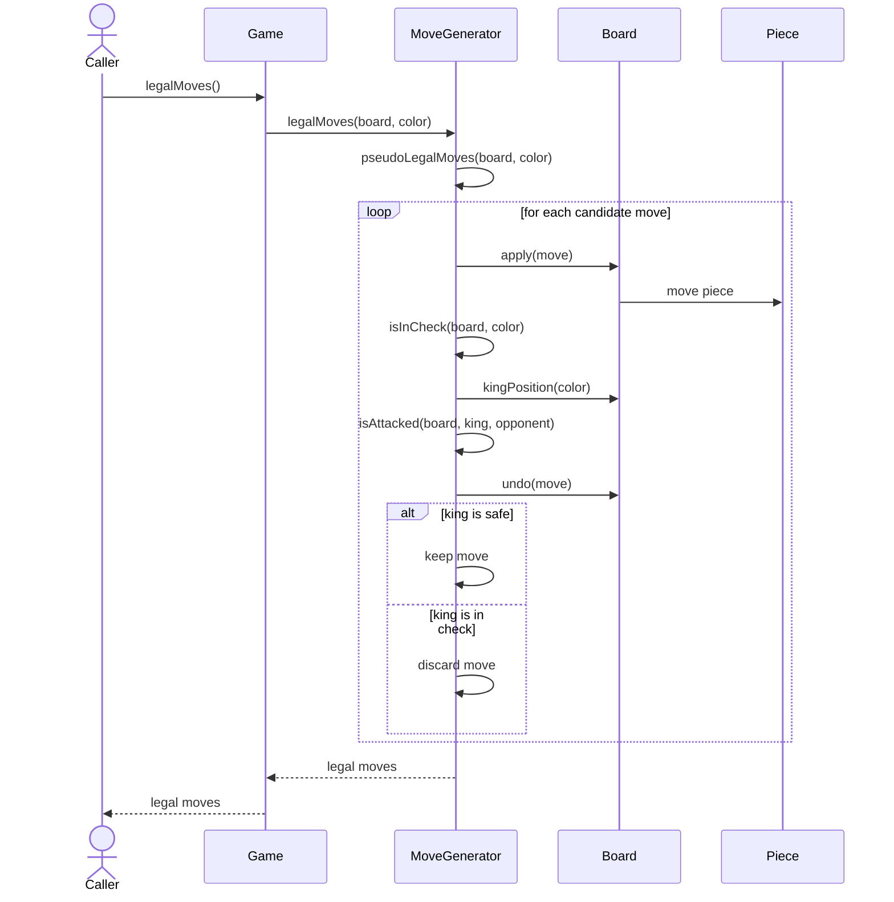
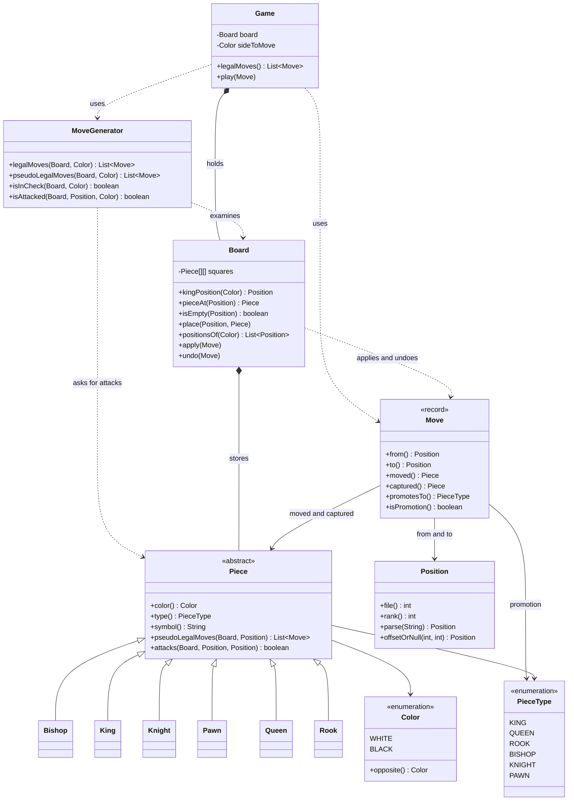

# M5 Design Diagrams

## Sequence diagram: `game.legalMoves()`

```mermaid
sequenceDiagram
    actor Caller
    participant Game
    participant MoveGenerator
    participant Board
    participant Piece

    Caller->>Game: legalMoves()
    Game->>MoveGenerator: legalMoves(board, color)
    MoveGenerator->>MoveGenerator: pseudoLegalMoves(board, color)

    loop for each candidate move
        MoveGenerator->>Board: apply(move)
        Board->>Piece: move piece
        MoveGenerator->>MoveGenerator: isInCheck(board, color)
        MoveGenerator->>Board: kingPosition(color)
        MoveGenerator->>MoveGenerator: isAttacked(board, king, opponent)
        MoveGenerator->>Board: undo(move)

        alt king is safe
            MoveGenerator->>MoveGenerator: keep move
        else king is in check
            MoveGenerator->>MoveGenerator: discard move
        end
    end

    MoveGenerator-->>Game: legal moves
    Game-->>Caller: legal moves
```

## Class diagram

```mermaid
classDiagram
    class Game {
        -Board board
        -Color sideToMove
        +legalMoves() List~Move~
        +play(Move)
    }

    class MoveGenerator {
        +legalMoves(Board, Color) List~Move~
        +pseudoLegalMoves(Board, Color) List~Move~
        +isInCheck(Board, Color) boolean
        +isAttacked(Board, Position, Color) boolean
    }

    class Board {
        -Piece[][] squares
        +kingPosition(Color) Position
        +pieceAt(Position) Piece
        +isEmpty(Position) boolean
        +place(Position, Piece)
        +positionsOf(Color) List~Position~
        +apply(Move)
        +undo(Move)
    }

    class Piece {
        <<abstract>>
        +color() Color
        +type() PieceType
        +symbol() String
        +pseudoLegalMoves(Board, Position) List~Move~
        +attacks(Board, Position, Position) boolean
    }

    class Bishop
    class King
    class Knight
    class Pawn
    class Queen
    class Rook

    class Color {
        <<enumeration>>
        WHITE
        BLACK
        +opposite() Color
    }

    class PieceType {
        <<enumeration>>
        KING
        QUEEN
        ROOK
        BISHOP
        KNIGHT
        PAWN
    }

    class Position {
        +file() int
        +rank() int
        +parse(String) Position
        +offsetOrNull(int, int) Position
    }

    class Move {
        <<record>>
        +from() Position
        +to() Position
        +moved() Piece
        +captured() Piece
        +promotesTo() PieceType
        +isPromotion() boolean
    }

    Piece <|-- Bishop
    Piece <|-- King
    Piece <|-- Knight
    Piece <|-- Pawn
    Piece <|-- Queen
    Piece <|-- Rook

    Game *-- Board : holds
    Game ..> MoveGenerator : uses
    Game ..> Move : uses
    MoveGenerator ..> Board : examines
    MoveGenerator ..> Piece : asks for attacks
    Board *-- Piece : stores
    Board ..> Move : applies and undoes
    Move --> Position : from and to
    Move --> Piece : moved and captured
    Move --> PieceType : promotion
    Piece --> Color
    Piece --> PieceType
```